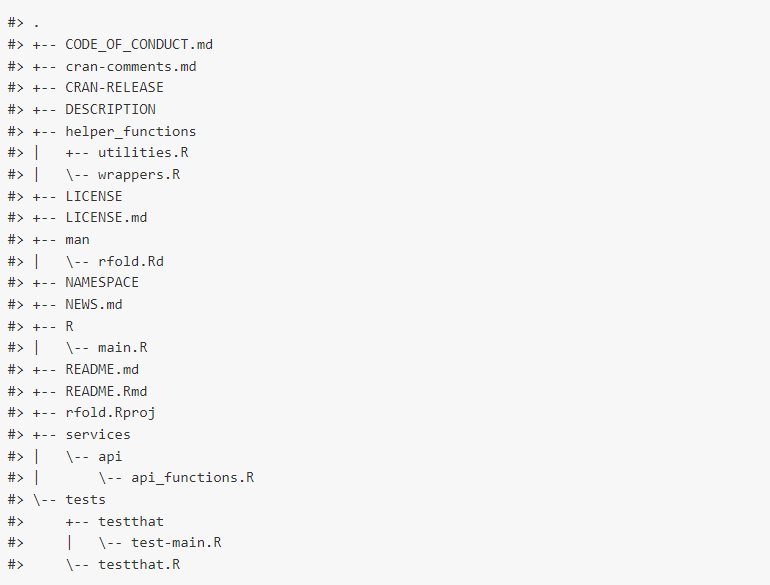
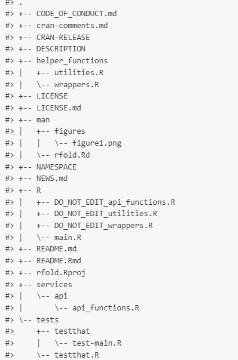

<!-- README.md is generated from README.Rmd. Please edit that file -->

# rfold

<!-- badges: start -->
[](https://CRAN.R-project.org/package=rfold)
[](https://cran.r-project.org/package=rfold)
[](https://cran.r-project.org/package=rfold)
<!-- badges: end -->

The goal of the `rfold` package is to allow `R` developers to work with
many `R` directories within an `R` package. A considerable limitation
regarding `R` packages development, is that one cannot create other
directories/sub directories (other than the `R` directory) and bind them
to the package ecosystem.

Using `rfold`, you can create as many directories/sub directories
(**outside of your `R` directory**).

The `rfold()` function will list all the `.R` scripts available outside
of the `R` folder, assign their names to `.Rbuildignore` file and
transfer them within the main `R` directory, giving you all the
flexibility you need to organize your package into many
directories/sub-directories.

## Installation

You can install the development version of `rfold` with:

``` r
install.packages("rfold")
```

## Usage

Just use `rfold::rfold()` before building or documenting your package
and you’re all set.

## Example

Suppose that within this package, I would decide to have the following
structure:



Running `rfold::rfold()`, all the external (external to the `R` folder)
`.R` scripts will be moved within the `R` folder:

``` r
rfold::rfold()
```

As such, I’ll get now the following structure:



Notice, that script names that will be transferred to the `R` folder
have their name prefixed with the character `DO_NOT_EDIT`. You can tweak
this feature or deactivate it using the `script_name_suffix` parameter
of the `rfold()` function.

The following comment will also be inserted at the top of each script
transferred into the R folder: **\# GENERATED BY FOLD: DO NOT EDIT BY
HAND \####**

There’s another parameter available, called `folders_to_ignore` which
allows you to ignore certain directories (for example `dev` directory)
when running the `rfold` function.

Note also that `devtools::build()` and `devtools::document()` will only
consider the scripts available within your `R` folder.

## Code of Conduct

Please note that the rfold project is released with a [Contributor Code
of
Conduct](https://contributor-covenant.org/version/2/0/CODE_OF_CONDUCT.html).
By contributing to this project, you agree to abide by its terms.
